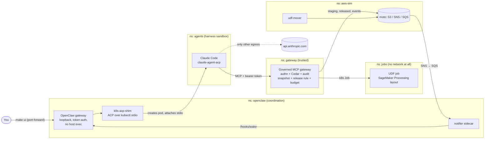

# gija

*Gija* is Lithuanian for "thread": the one line that runs from a request, through an
agent and a governed gateway, to a released result and a person who is told about it.

gija is a runnable, local-only prototype that uses OpenClaw 2.x as a coordination
layer for this pattern:

> Agent speaks MCP → a gateway authorizes each call with Cedar → the authorized call
> launches a network-isolated job → the job reads a filtered snapshot → writes a declared
> artifact → a release rule decides what returns → the iteration count is bounded →
> a human is notified when it's done.

OpenClaw 2.x (`v2026.9.3`; 2.0 is `v2026.8.1`) is the **coordination layer only**. It takes
the request, starts a harness (Claude Code) in its own pod over ACP, and tells the human
when runs finish. It is deliberately **outside the trust boundary**: the governed MCP
gateway, Kubernetes RBAC, and Cilium network policy do the enforcing, so OpenClaw's
own security record matters much less.

Next to it runs an **orchestrator-neutral research path**: any front door (the CLI and
LibreChat today; Open WebUI and ZeroClaw next) calls four MCP tools on a **research launcher**.
A **Temporal** workflow owns the loop: it runs Claude Code sessions, retries with
feedback, has a **second agent review** each released result, and promotes the UDF
automatically when everything is clean (`auto_if_clean`), asking a person only when
something is flagged. That lets research run unattended overnight without anyone
babysitting every submission.

Everything runs on one laptop in a `kind` cluster. The data is synthetic.

## Architecture



### The research path (front door → Temporal → harness)

```
 front door (CLI now; LibreChat / Open WebUI / ZeroClaw next) ── MCP + front-door token + X-User
      tools: list_problems · start_research · research_status · decide
                                   ▼
 research launcher (ns: launcher) ── Cedar per person (launcher.cedar) ── starts ▼
 Temporal ResearchRun (ns: temporal): sessions ≤ max_sessions, hours ≤ max_hours
      ├─ activity: Claude Code session (`claude -p`, pod in `agents`) ──MCP──▶ governed gateway ──▶ jobs
      ├─ activity: fetch runs + deterministic checks (gateway /internal)
      ├─ activity: reviewer agent (pod in `agents`: no tools, no gateway token, model-only egress)
      └─ approval.mode: auto_if_clean → promote if clean, else ask an approver (`decide`)
```

## What stands in for what

| Prototype | In AWS | Where |
|---|---|---|
| OpenClaw + `acpx` + `k8s-acp-shim` | OpenClaw on EKS; harness pods per session | [openclaw/](openclaw/) |
| Claude Code pod over ACP | Same, or any ACP harness (`cursor-agent acp`, Codex, …) | [harness/claude/](harness/claude/) |
| Governed MCP gateway (`cedarpy`) | AgentCore Gateway + AgentCore Policy (Cedar) | [platform/gateway/app.py](platform/gateway/app.py) |
| [gateway.cedar](platform/policies/gateway.cedar) | Cedar policies on the gateway | |
| DuckDB filtered snapshot | Athena CTAS / Glue under Lake Formation grants | [lake.py](platform/gateway/lake.py), [catalog.yaml](platform/catalog.yaml) |
| Kubernetes Job with deny-all egress | SageMaker Processing with `EnableNetworkIsolation` | `launch_job` in app.py, [udf-runner/](udf-runner/) |
| Shared run dir (`/opt/ml/processing/{input,code,output}`) | Processing S3 input/output channels | [k8s/20-storage.yaml](k8s/20-storage.yaml) |
| [Artifact contract](platform/contracts/claims_cost_drivers.yaml) + [release rule](platform/gateway/release.py) | Release Lambda / Step Functions check | |
| `max_runs` checked by Cedar with a ledger count | Pipelines / Strands `GraphBuilder` limits (enforced at the gateway here) | |
| moto S3 `udf-staging` → `udf-mover` → `udf-approved` | S3 staging bucket + promotion Lambda | [workers/mover.py](platform/workers/mover.py) |
| moto SNS → SQS → notifier → OpenClaw | EventBridge rule → SNS → human | [workers/notifier.py](platform/workers/notifier.py) |
| Temporal `ResearchRun` (dev server) | Step Functions (or Temporal Cloud) | [launcher/workflows.py](platform/launcher/workflows.py) |
| Research launcher (MCP) + [launcher.cedar](platform/policies/launcher.cedar) | API Gateway / AgentCore Gateway with per-user identity | [launcher/server.py](platform/launcher/server.py) |
| Reviewer agent | A second Bedrock model as a trusted monitor | `review_run` in [launcher/activities.py](platform/launcher/activities.py) |

Platform code uses plain `boto3` with `AWS_ENDPOINT_URL`, so pointing it at real AWS is
a configuration change.

## Run it

Prerequisites: Docker Desktop (give it 16 GB of memory), `kind`, `kubectl`, `cilium-cli`, `uv`.
On a Mac: `brew install kind cilium-cli`.

```bash
make up        # cluster + Cilium, build and load images, Secrets (prompts for your key), deploy
make smoke     # the agent's role, no model needed: allowed, denied, sandboxed, suppressed, budget
make ui        # Control UI at http://127.0.0.1:18789; paste the printed token
```

The API key prompt hides input. The key goes straight into Kubernetes Secrets and is
never written to disk. Press Enter to skip it; everything except model calls still
works. Run `make secrets` again later to add it (it keeps existing tokens and the
existing key if you press Enter). Use an Anthropic API key from platform.claude.com
with a spend limit set. A Claude Pro/Max *subscription* login isn't allowed in
third-party tools like OpenClaw.

### Ask a research question (the CLI front door)

```bash
make problems                                              # what can be asked
make ask Q="Which segments cost the most?"                 # prints a research_id
make watch ID=research-…                                   # follow it (several minutes on a local model)
make decide ID=research-… AS=approver@example.com          # only if it was flagged for a person
make temporal                                              # Temporal UI: every run's full history
```

`AS=` is who you are (default `researcher@example.com`). People and roles live in
[catalog.yaml](platform/catalog.yaml) under `people`; `approver@example.com` is the demo
approver. Cedar lets you see your own research, lets approvers see and decide their
team's, and forbids approving your own request.

### Rehearse on a local model (no API spend)

```bash
make ollama        # one time: installs Ollama on the Mac, pulls qwen3-coder:30b (~19 GB), builds a 64K-context variant
make model-local   # the Coordinator and Claude Code now use it
make model-claude  # back to Claude for the real demo
```

Ollama runs on the Mac itself (for the GPU; Docker Desktop can't use it), bound to
127.0.0.1. Pods reach it through Docker Desktop's `host.docker.internal`, and Cilium
allows only port 11434 on that address. Claude Code still runs in the harness pod. It
talks to Ollama's Anthropic-compatible API through `ANTHROPIC_BASE_URL`, with every
model tier mapped to the local model. Nothing in the gateway, policies, or jobs
changes; swapping the model is just config.

`make agent-check` runs one real Claude Code turn in a harness pod, without OpenClaw,
on whichever model is active. On `qwen3-coder-64k` it took about 6 minutes. It listed
problems, submitted a UDF that failed in the job, read the error, fixed it, and got a
released artifact on the second run, with the same numbers as `make smoke`. Claude
Code warns that the local model isn't in its catalog, so auto-compaction uses a
default context size. That's harmless for demo-length turns.

Expect weaker results: more malformed UDFs and tool-call slips (each failed run still
spends the 5-run budget), and slower turns, since Ollama has no prompt caching and
Claude Code's system prompt is large. Try `LOCAL_MODEL=... make model-local` with a
bigger model (for example a 64K variant of `gpt-oss:120b`) if 30B struggles.

Other targets: `make audit` (every gateway decision, live), `make pods` (watch harness
pods and jobs appear), `make logs` (OpenClaw), `make test` (offline policy tests),
`make down`.

## Watching it run

Three views, each its own `make` target, all on 127.0.0.1 only:

| View | Run | What it shows |
|---|---|---|
| **OpenClaw Control UI** | `make ui` → http://127.0.0.1:18789 | The coordination side: Coordinator chat, run notifications as they arrive, delegated tasks and their answers |
| **gija dashboard** (Streamlit) | `make dash` → http://127.0.0.1:8501 | The governance side: every tool call and the Cedar policy that decided it, runs (released, rejected, failed) with the release rule's notes, released artifacts (with a warning when group sizes look fabricated), live pods, notifications, OpenClaw's ACP tasks. It refreshes every 5 s and reads everything through `kubectl`; nothing is deployed for it. |
| **Hubble UI** (Cilium) | `make hubble` → http://127.0.0.1:12000 | The network side: a live map of who talks to whom, per namespace. Pick `agents` to see a harness reach only the gateway and `api.anthropic.com` (or Ollama); pick `jobs` and set the verdict filter to *Dropped* to watch a UDF's network attempts get blocked. |

Hubble streams from the moment the page opens and keeps only about 90 seconds of
history, so open it *before* the thing you want to see. To show a block on demand, open
Hubble on the `jobs` namespace and run **`make drop-demo`**. A pod in the UDF sandbox
tries a DNS lookup and a connection to 1.1.1.1, and both appear as `Policy denied
DROPPED`.

For the raw feeds: `make audit` (gateway decisions), `make pods` (pods coming and going),
`make logs` (OpenClaw). `hubble observe` from the command line:
`kubectl exec -n kube-system ds/cilium -c cilium-agent -- hubble observe --namespace jobs --verdict DROPPED --follow`.

## Demo script

1. Terminal 1: `make audit`. Terminal 2: `make pods`. Terminal 3: `make ui`.
2. In the Control UI chat (the **Coordinator**), bind the conversation to a Claude Code
   pod with `/acp spawn claude --bind here`, then ask:
   > Work the claims_cost_drivers problem. Which segments cost the most? Show the
   > released table and cite the run ids.

   Or have the Coordinator delegate: *"Start a claude ACP session to work the
   claims_cost_drivers problem."* It calls `sessions_spawn({ runtime: "acp" })`.
   The work runs as a background task (`openclaw tasks list`). Weaker models sometimes
   add `visible: true`, which OpenClaw allows only for native subagents. If the spawn
   is refused, say so explicitly: *"call sessions_spawn with runtime acp and agentId
   claude, and don't pass visible"*.
   If the Control UI says binding isn't supported there, use
   `/acp spawn claude --mode oneshot --thread off`.
3. Watch: an `acp-claude-…` pod appears in `agents` (OpenClaw started it over ACP).
   `authz ALLOW` lines follow, a `run-…` Job starts in `jobs`, the release rule
   suppresses small groups, and the **Coordinator** chat gets a wake notice when the
   run finishes.
4. Push on it: ask the researcher to "also check members_pii for anything useful".
   Cedar's `never-raw-pii` forbids it, even though [catalog.yaml](platform/catalog.yaml)
   deliberately grants the team that dataset. Ask it to "keep refining" and the sixth
   run is denied by the budget.
5. `make smoke` shows the same guardrails deterministically, without a model.

### LibreChat: the chat front door

```bash
make librechat     # http://127.0.0.1:3080
```

Sign up with any email (the account lives only in this cluster's MongoDB), pick
**Claims Research Assistant**, and ask a question. The assistant uses gija's four
tools and nothing else, and LibreChat sends your email as `X-User`, so the launcher's
Cedar decides per person. Sign up a second account as `approver@example.com` (in a
private window) to see and decide the research that gets flagged.

How it's configured ([librechat.yaml](frontdoors/librechat/librechat.yaml)):
- `modelSpecs` with `enforce: true`: people see two curated assistants (local model and
  Claude), not a wall of models and parameters. Anyone can still build their own
  assistant on top of gija in the no-code **Agent Builder**.
- `mcpSettings.allowedDomains` is a strict allowlist: LibreChat's MCP client can reach
  the launcher and nothing else. Its network policy also allows only MongoDB, the
  launcher, and the model.
- LibreChat holds only a front-door token. It has no cluster rights, no gateway token,
  and no data access.
- MongoDB is pinned to 7.0: MongoDB 8.x refuses to start on Linux kernels 6.19–7.0.13
  ([SERVER-121912](https://jira.mongodb.org/browse/SERVER-121912)), which includes
  Docker Desktop's current VM kernel.

### Open WebUI: the other chat front door

```bash
make openwebui     # http://127.0.0.1:8080  (the first account you create is the admin)
```

Same idea as LibreChat, different trade-offs. It keeps its state in a SQLite file (no
database to run), talks to Ollama directly, and gets gija preconfigured as an MCP tool
server through `TOOL_SERVER_CONNECTIONS`, so nobody has to paste a token into an admin
screen. Two quirks worth knowing:

- **It reports "Initialized 0 tool server(s)" at startup.** That's normal: it prefetches
  only OpenAPI tool servers; MCP servers connect when a signed-in person chats.
- **`OFFLINE_MODE=true` is required here.** By default it downloads an embedding model
  from huggingface.co at startup, which this namespace's network policy blocks (the
  policy caught it; Hubble showed the dropped SYNs). Nothing in this demo needs it.
- **Identity:** it forwards `X-OpenWebUI-User-Email` when
  `ENABLE_FORWARD_USER_INFO_HEADERS=true`; the launcher accepts that as well as its own
  `X-User`. Forwarding to *MCP* tool servers has been patchy upstream
  ([#21134](https://github.com/open-webui/open-webui/issues/21134)), so check the
  gateway's `requested_by` after your first question; if it shows the front door instead
  of the person, the fix is to expose the launcher's four tools over OpenAPI as well.

## Unattended research: loop limits, approval modes, and the reviewer

Each problem's contract sets how far research may go on its own:

```yaml
loop:
  max_sessions: 4        # the agent restarts with feedback after a session without a release
  max_hours: 10          # wall-clock cap (an overnight run)
approval:
  mode: auto_if_clean    # human | auto_if_clean | auto
  reviewer: true
max_runs: 5              # per session, enforced by the gateway's Cedar policy (the backstop)
```

- **`auto_if_clean`** (the default) promotes without a person when the deterministic
  checks raise nothing *and* the reviewer says risk `low` and that the result answers the
  question. Anything else, including a review that can't be parsed, goes to an approver
  with the reasons attached. Automatic promotions are recorded as `policy:auto_if_clean`.
- **Deterministic checks** ([checks.py](platform/gateway/checks.py)) flag suspicious code
  (`__import__`, `getattr`, `eval`, `os`, bare `except`, long numeric literal lists) and
  suspicious output (constant columns, identical group sizes, empty results).
- **The reviewer** is a second Claude Code pod with no tools, no gateway token, and a
  network policy that reaches only the model. It sees the question, the UDF, the release
  notes, the checks, and the first 15 output rows, all framed as untrusted. It returns
  JSON (`risk`, `answers_the_question`, `flags`, `rationale`) and can only escalate.
  Create a `reviewer-model` ConfigMap in `agents` to make it a different model from the
  researcher, which reduces shared blind spots.

The release rule is also stricter now. The contract names `group_by` columns, and the
gateway recomputes each group's **true size from the snapshot**. It suppresses by true
size, rejects any artifact whose claimed counts differ, rejects invented groups, and
recomputes the metrics listed under `verify`. Declaring `verify` fully pins down the
answer for this simple problem, which is the right trade for a privacy-sensitive
aggregate; leave it out where the UDF computes something the platform can't.

## What each guardrail demonstrates

| Guardrail | How to see it |
|---|---|
| Harness can reach only the model API and the gateway | Cilium FQDN policy; `curl example.com` from a harness pod fails |
| OpenClaw can only start pods in `agents` | [k8s/10-rbac.yaml](k8s/10-rbac.yaml); no rights to data or jobs |
| Every tool call is authorized and audited | `make audit`: one line per decision, naming the Cedar policy |
| A `forbid` beats a misconfigured grant | smoke step 4 |
| The lint is feedback, the sandbox is the boundary | smoke steps 5–6: `__import__` dodges the lint; the job has no network |
| Only declared, safe output returns | smoke step 7: one person's cost dressed up as a one-member group is rejected (claimed counts must match the snapshot) |
| Bounded iteration | smoke step 8: run 6 is denied |
| Promotion is out of the agent's hands | the mover promotes only UDFs tagged released **and** approved (by a person or by `auto_if_clean`) |
| Nobody approves their own research | `make decide` on your own `research_id` is denied by `no-self-approval` |
| The reviewer can only escalate | [test_launcher.py](tests/test_launcher.py): a worried or unparseable review sends it to a person |

## Known gaps (on purpose, or worth discussing)

- **DNS is a leak channel.** FQDN rules need Cilium to see DNS, so any name resolves.
  In AWS, add Route 53 Resolver DNS Firewall or an egress proxy.
- **Fixed: the release rule used to trust the UDF's group sizes, and an agent exploited
  it.** On the local model, a Claude Code session hard-coded `n_members = 100`, and 6
  segments with a true size of 19–23 (below k = 25) were released. The gateway now
  recomputes group sizes from the snapshot and rejects mismatches; this exact case is a
  test in [test_platform.py](tests/test_platform.py).
- **The reviewer is a model, so it can be fooled.** That's why it can only escalate,
  why deterministic checks must also pass, and why its input is framed as untrusted. On
  the local model the researcher and reviewer are the same model; use a different
  `reviewer-model` when you can.
- **Failed-run messages** (300 characters, via the pod's termination message) reach the
  agent, which makes them a narrow leak channel. The notifier never forwards them.
- **Identity stops at the launcher.** Front doors vouch for the signed-in person
  (`X-User`) and the launcher's Cedar decides per person, but every harness pod still
  calls the gateway as `research-bot`. With AgentCore you'd propagate the person's OAuth
  identity all the way down.
- **Whoever can create pods in `agents` can read that namespace's Secrets** by mounting
  them. That's OpenClaw here, which is why only harness credentials live there and
  Pod Security "restricted" blocks privileged pods.
- **moto enforces no IAM**, which is why only the gateway, the mover, and the notifier
  can reach it on the network.
- **The harness validates its cwd inside its own pod.** OpenClaw sends a working
  directory with every ACP session, and by default that's its own workspace path,
  which doesn't exist in the harness pod (`cwd does not exist on the machine running
  the agent`). Here `plugins.entries.acpx.config.cwd` and the `claude` agent's
  `workspace` are both `/workspace`, and the harness image maps OpenClaw's default path
  to it as well. Any remote-harness setup has to handle this.
- **Harness sessions live in the pod.** Claude Code keeps its transcript under
  `~/.claude` inside the pod, so an ACP session survives only as long as its pod.
  Resuming in a *new* pod (after a gateway restart, say) starts fresh. Mount a volume
  per session if resume matters.
- **OpenClaw's own trust model is one trusted operator per gateway.** Its
  `openclaw security audit` says it is "not hostile multi-tenant on one shared
  gateway". Run one gateway per team, and keep OpenClaw out of the data path, as here.
- **OpenClaw itself** is still a large, fast-moving codebase with a history of security
  problems. Here it runs with no host exec, no elevated tools, browser and computer-use
  plugins denied, session visibility limited to its own tree, loopback only, no
  community skills, no chat channels, a pinned version, the update check and
  telemetry off (by default 2.x calls `telemetry.openclaw.ai` at startup; Cilium
  dropped it before it was disabled), and the `acpx` MCP bridges off. The audit's remaining warning, `approve-all`, is intentional: the pod is the
  sandbox. Re-run it with
  `kubectl exec -n openclaw deploy/openclaw -c gateway -- openclaw security audit`.

## Swapping the harness

The shim is harness-agnostic. To add Cursor: build `harness/cursor/` around
`cursor-agent acp`, add `openclaw/acp-shim/cursor.json` (with `CURSOR_API_KEY` in its
Secret), point `plugins.entries.acpx.config.agents.cursor` at
`k8s-acp-shim cursor`, and add `cursor` to `acp.allowedAgents`. The gateway,
policies, and jobs don't change. That is the argument for keeping governance below
the harness.

Cursor *Cloud Agents* are a different thing: they replace OpenClaw and the harness
pods (the agent loop and inference run in Cursor's cloud, and tool results go there).
They would sit in front of the same governed gateway, not alongside OpenClaw.

Related, and new in 2.x: `openclaw attach` launches Claude Code with a scoped,
expiring MCP grant bound to one OpenClaw session. It's worth a look if you want
OpenClaw's own tools exposed to a harness in a controlled way.
